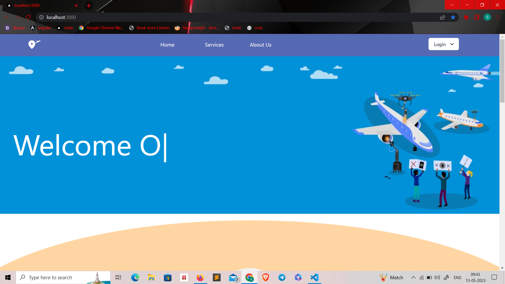
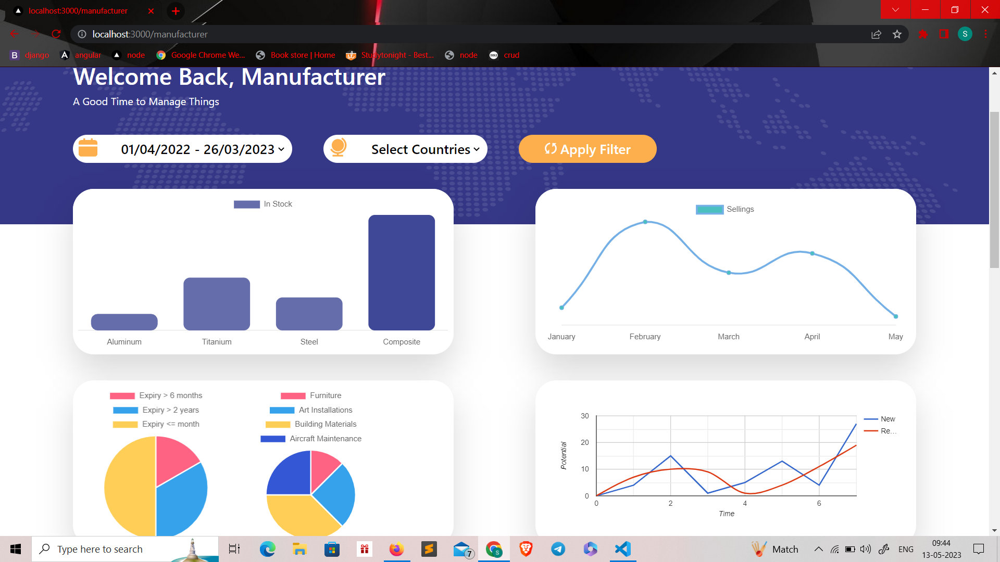
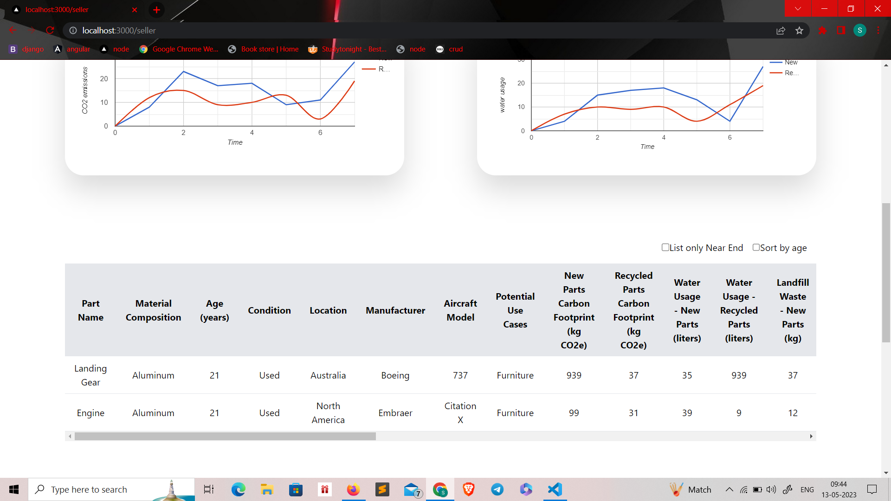
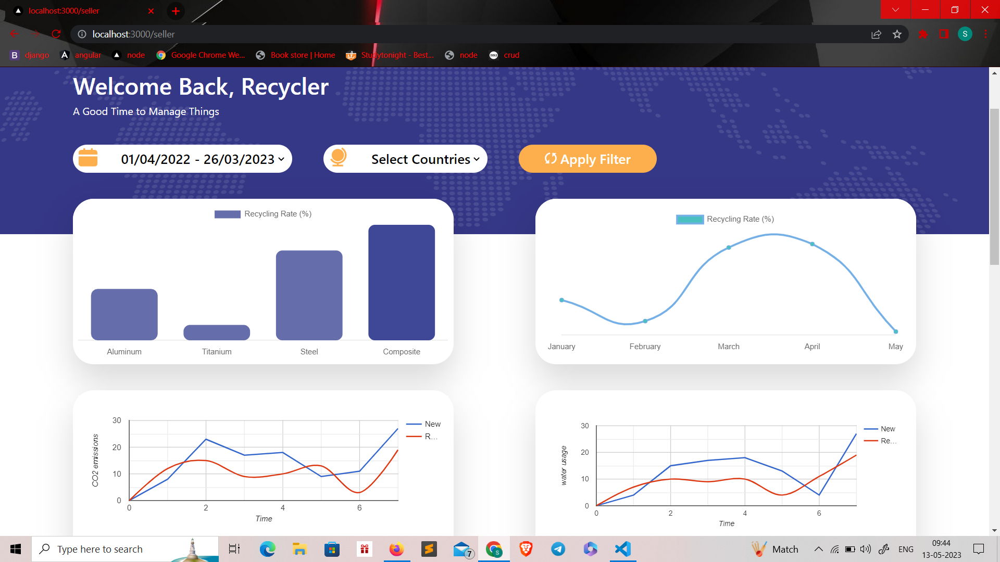
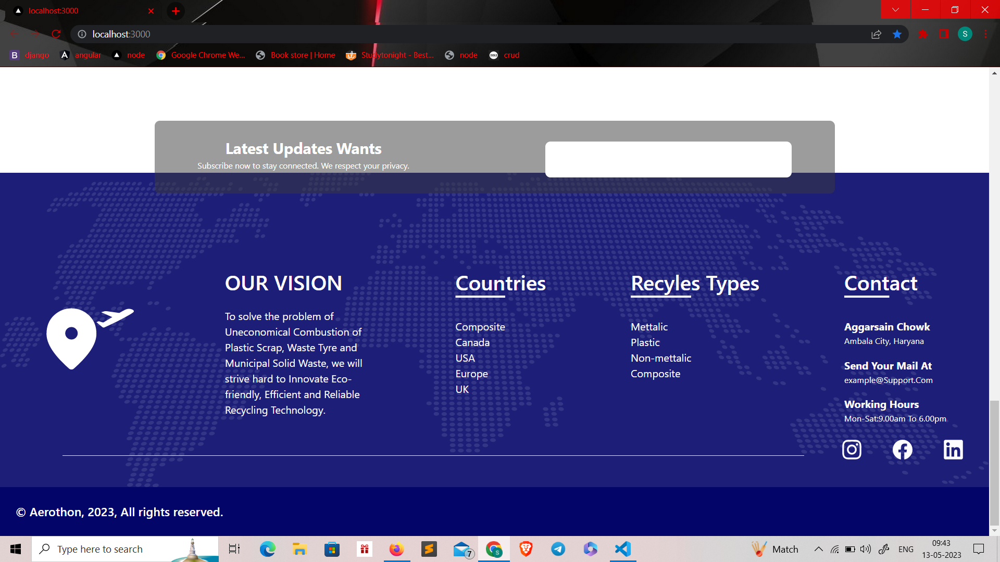
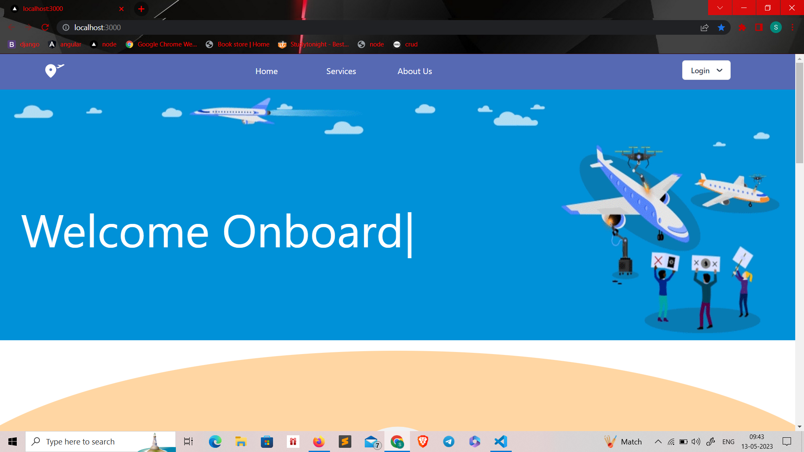

This is a [Next.js](https://nextjs.org/) project bootstrapped with [`create-next-app`](https://github.com/vercel/next.js/tree/canary/packages/create-next-app).

## Getting Started

This is a aerothon hackathon project,where we have to provide a platform for manufacturere, airlines and recycler for effective use of new or recycled products.This repo contains only the frontend code, backend code is not integrated yet as API's are not tested yet.The front end code is complete responsive supporting all screen size devices.

## Some ScreenShots

